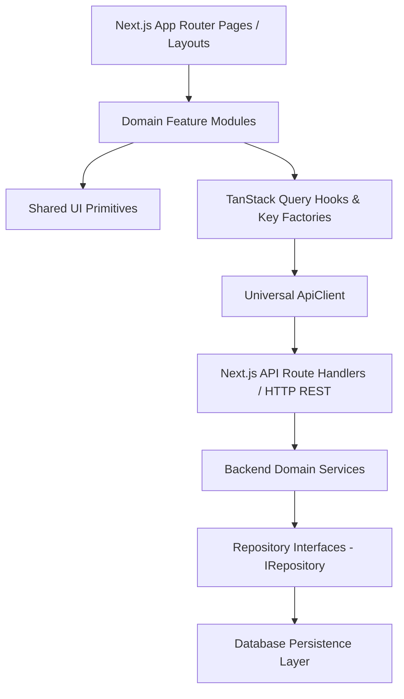

# Architecture & Engineering Specifications

## 1. System Overview

`NulisBareng` is a modern, full-stack, collaborative real-time workspace application (conceptually similar to Trello and Notion). It is built on a modular architecture designed for high scalability, type safety, testability, and real-time event distribution.

---

## 2. Layered Architecture & Boundary Flow



### Dependency Inversion & Strict Boundary Rules

1. **Presentation Layer (`src/components/ui`, `src/app`)**:
   - Contains presentation and routing logic.
   - Strictly isolated from direct database queries or raw un-typed `fetch` calls.
   - Communicates exclusively through domain feature hooks or Server Actions/API Route handlers.

2. **Feature Modules (`src/features/*`)**:
   - Encapsulates domain-specific hooks, queries, mutations, types, and schemas.
   - Features do not import private internal files from sibling features; communication happens via shared types or exported public feature APIs.

3. **API & Data Access Layer (`src/lib/api`, `src/server/db`)**:
   - Universal `ApiClient` normalizes all network requests, timeouts, and responses.
   - Backend service layer implements business rules against `IRepository` interfaces rather than coupled ORM clients.

---

## 3. Server State & TanStack Query Strategy

All server data is managed through TanStack Query (`@tanstack/react-query`).

### Query Key Factories (`src/lib/query/query-keys.ts`)

Magic strings are strictly forbidden in cache keys. Hierarchical factories ensure type safety and structured cache invalidation:

```typescript
// Examples:
workspaceKeys.all; // ['workspaces']
workspaceKeys.lists(); // ['workspaces', 'list']
workspaceKeys.list(filters); // ['workspaces', 'list', { ...filters }]
workspaceKeys.detail(id); // ['workspaces', 'detail', id]
workspaceKeys.members(id); // ['workspaces', 'detail', id, 'members']
```

### Default Cache Policies (`src/lib/query/query-client.ts`)

- **Stale Time**: 2 minutes (`staleTime: 1000 * 60 * 2`)
- **Garbage Collection Time**: 10 minutes (`gcTime: 1000 * 60 * 10`)
- **Retry Strategy**: Exponential backoff up to 3 attempts, skipping 401, 403, and 404 client errors.
- **Window Focus Refetch**: Enabled in production.

---

## 4. Universal Error Hierarchy (`src/lib/api/errors.ts`)

All application and network errors derive from `AppError` and are mapped to standard HTTP status codes:

| Error Class           | Status Code | Error Code              | Description                                   |
| :-------------------- | :---------- | :---------------------- | :-------------------------------------------- |
| `ValidationError`     | 400         | `VALIDATION_ERROR`      | Schema/input validation failure               |
| `UnauthorizedError`   | 401         | `UNAUTHORIZED`          | Missing or invalid authentication credentials |
| `ForbiddenError`      | 403         | `FORBIDDEN`             | Authenticated user lacks permission           |
| `NotFoundError`       | 404         | `NOT_FOUND`             | Resource could not be found                   |
| `ConflictError`       | 409         | `CONFLICT`              | Resource already exists or version conflict   |
| `RateLimitError`      | 429         | `RATE_LIMIT_EXCEEDED`   | Exceeded rate limit quota                     |
| `InternalServerError` | 500         | `INTERNAL_SERVER_ERROR` | Unexpected server failure                     |
| `NetworkError`        | 0           | `NETWORK_ERROR`         | Connection dropped, timeout, or unreachable   |

---

## 5. Real-Time Extension Points (`src/lib/realtime/events.ts`)

The system establishes typed contracts for event-driven collaboration without locking into a specific transport layer.

Supported real-time events:

- `CARD_CREATED`, `CARD_UPDATED`, `CARD_MOVED`, `CARD_DELETED`
- `DOCUMENT_UPDATED`, `DOCUMENT_SAVED`
- `MEMBER_JOINED`, `MEMBER_LEFT`
- `PRESENCE_UPDATED`
- `NOTIFICATION_RECEIVED`

When WebSockets, Server-Sent Events, or WebRTC are introduced in subsequent phases, handlers connect directly to these event contracts.

---

## 6. Environment Configuration & Fail-Fast Validation (`src/config/env.ts`)

Direct access to `process.env` in application code is prohibited.
All environment variables are validated at startup via Zod schemas, enforcing separation between client-safe variables (`NEXT_PUBLIC_`) and secret server-only variables (`DATABASE_URL`, `AUTH_SECRET`).
